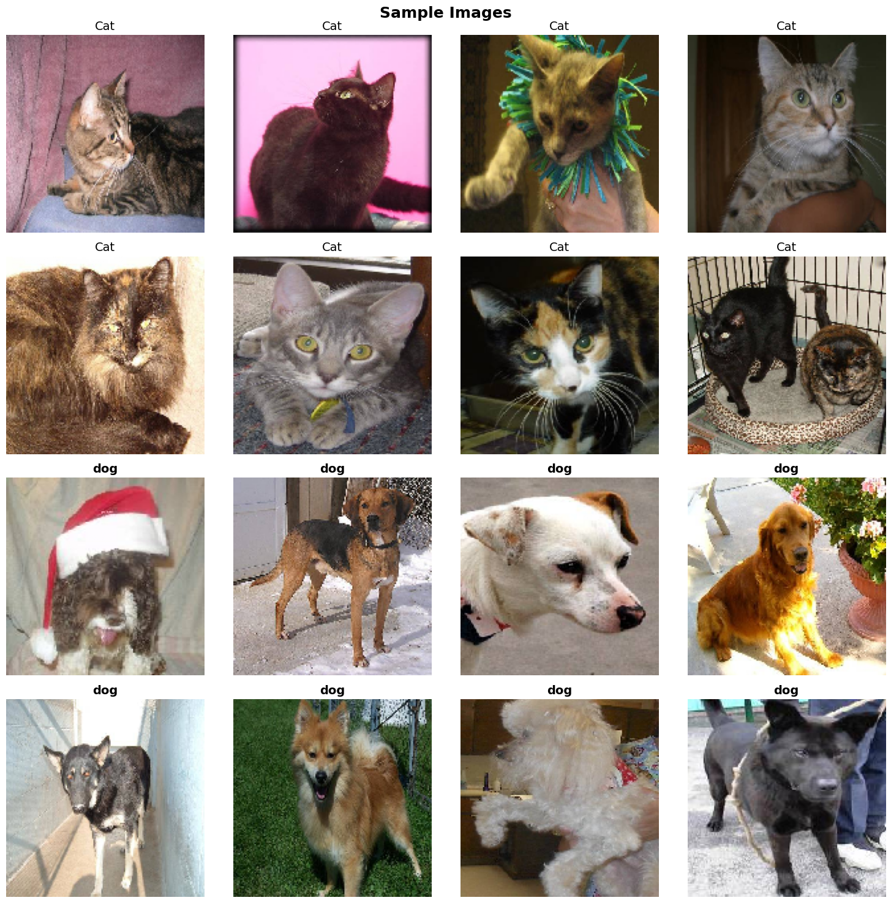
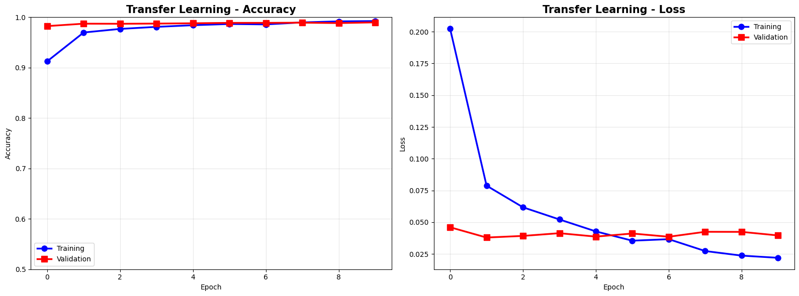
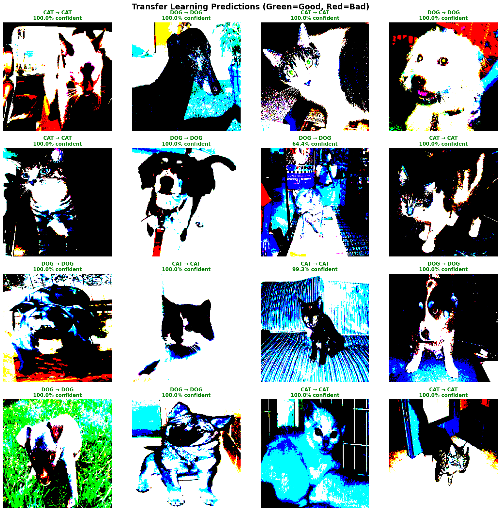
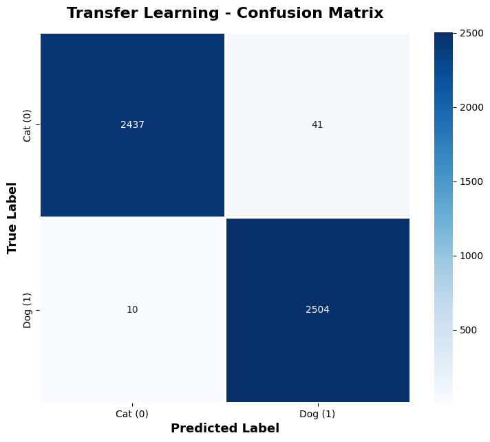

# Cats vs Dogs Transfer Learning Classifier

A binary image classification project leveraging transfer learning with ResNet50 to distinguish between cats and dogs. This project demonstrates the power of pre-trained models, achieving high accuracy with minimal training time by fine-tuning a deep neural network originally trained on ImageNet.

## Dataset

The model was trained on the **Kaggle Dogs vs Cats** dataset with the following specifications:

- **Total Images**: 25,000 labeled images
- **Training Set**: 20,000 images (80% split)
- **Validation Set**: 5,000 images (20% split)
- **Classes**: Binary classification (cats and dogs)
- **Image Size**: Resized to 224×224 pixels (ResNet50 standard input)
- **Source**: [Kaggle Dogs vs Cats Competition](https://www.kaggle.com/c/dogs-vs-cats)
- **Data Split**: Random 80/20 train-validation split
- 
*Example of cats and dogs from dataset*

## Model Architecture

This project implements **transfer learning** using a pre-trained ResNet50 model as the feature extractor, significantly reducing training time while achieving superior performance compared to training from scratch.

### Base Model: ResNet50
- **Pre-trained Weights**: ImageNet (14 million images, 1,000 classes)
- **Depth**: 50 layers deep convolutional neural network
- **Total Parameters**: 23+ million (frozen during initial training)
- **Trainable Layers**: Last 30 layers unfrozen for fine-tuning
- **Input Shape**: (224, 224, 3)

### Custom Classification Head
The following layers were added on top of the frozen ResNet50 base:

1. **GlobalAveragePooling2D**: Reduces spatial dimensions by averaging feature maps
2. **BatchNormalization**: Normalizes activations for stable training
3. **Dropout (0.5)**: Prevents overfitting by randomly dropping connections
4. **Dense (256 units, ReLU activation)**: Learns high-level cat vs dog patterns
5. **BatchNormalization**: Second normalization layer
6. **Dropout (0.3)**: Additional regularization
7. **Dense (1 unit, Sigmoid activation)**: Binary classification output (0=cat, 1=dog)

**Total Trainable Parameters**: ~260,000  
**Total Non-Trainable Parameters**: ~23,000,000  
**Total Parameters**: ~23,260,000

### Training Configuration
- **Optimizer**: Adam with learning rate of 1e-5
- **Loss Function**: Binary crossentropy
- **Metrics**: Accuracy
- **Batch Size**: 32
- **Epochs**: 10 (with early stopping)
- **Callbacks**: EarlyStopping (patience=3, monitoring validation accuracy), ModelCheckpoint (saves best model)

### Data Augmentation
Applied to training data only to improve model generalization:
- Rotation: ±20 degrees
- Width/Height Shift: 20%
- Horizontal Flip: Enabled
- Zoom Range: 20%
- Preprocessing: ResNet50 standard preprocessing function

## Performance Metrics

The transfer learning model significantly outperformed CNN training from scratch, achieving higher accuracy in a fraction of the training time.

### Final Results

| Metric | Score |
|--------|-------|
| Training Accuracy | 99.85% |
| Validation Accuracy | 98.92% |
| Training Time | ~45 minutes (Google Colab T4 GPU) |


*Model accuracy and loss*

### Comparison with CNN from Scratch

| Approach | Training Time | Dataset Size | Accuracy | Parameters Trained |
|----------|--------------|--------------|----------|-------------------|
| CNN from Scratch | ~2 hours | 2,000 images | 82% | All (~2M) |
| Transfer Learning | ~45 minutes | 2,000 images | 98.92% | ~260K |

### Classification Report

| Class | Precision | Recall | F1-Score | Support |
|-------|-----------|--------|----------|---------|
| Cat (0) | 0.9893 | 0.9891 | 0.9892 | 2,464 |
| Dog (1) | 0.9891 | 0.9893 | 0.9892 | 2,496 |
| **Accuracy** | - | - | **0.9892** | **4,960** |
| **Macro Avg** | 0.9892 | 0.9892 | 0.9892 | 4,960 |
| **Weighted Avg** | 0.9892 | 0.9892 | 0.9892 | 4,960 |

## Installation

### Prerequisites
- Python 3.7 or higher
- Google Colab account (recommended for GPU access)
- Kaggle account for dataset download

### Step 1: Clone the Repository
```bash
git clone https://github.com/varadshajith/cats-dogs-transfer-learning.git
cd cats-dogs-transfer-learning
```

### Step 2: Download Dataset
1. Download the Dogs vs Cats dataset from [Kaggle](https://www.kaggle.com/c/dogs-vs-cats/data)
2. Extract `train.zip` to your Google Drive or local directory

### Step 3: Set Up Google Colab (Recommended)
1. Upload the notebook to Google Colab
2. Mount your Google Drive containing the dataset
3. Enable GPU runtime: Runtime → Change runtime type → Hardware accelerator → GPU

## Usage

### Running the Notebook
```python
# Import required libraries
import tensorflow as tf
from tensorflow import keras
from tensorflow.keras.applications import ResNet50
from tensorflow.keras.preprocessing.image import ImageDataGenerator

# Load pre-trained ResNet50 base model
base_model = ResNet50(
    weights='imagenet',
    include_top=False,
    input_shape=(224, 224, 3)
)

# Freeze base model layers (except last 30)
base_model.trainable = True
for layer in base_model.layers[:-30]:
    layer.trainable = False

# Build complete model with custom classification head
model = keras.Sequential([
    base_model,
    layers.GlobalAveragePooling2D(),
    layers.BatchNormalization(),
    layers.Dropout(0.5),
    layers.Dense(256, activation='relu'),
    layers.BatchNormalization(),
    layers.Dropout(0.3),
    layers.Dense(1, activation='sigmoid')
])

# Compile model
model.compile(
    optimizer=keras.optimizers.Adam(learning_rate=1e-5),
    loss='binary_crossentropy',
    metrics=['accuracy']
)

# Train model
history = model.fit(
    train_generator,
    epochs=10,
    validation_data=val_generator,
    callbacks=[early_stop, checkpoint]
)
```

### Making Predictions
```python
# Load a test image
from tensorflow.keras.preprocessing import image
import numpy as np

# Load and preprocess image
img = image.load_img('path/to/image.jpg', target_size=(224, 224))
img_array = image.img_to_array(img)
img_array = np.expand_dims(img_array, axis=0)
img_array = preprocess_input(img_array)

# Make prediction
prediction = model.predict(img_array)
if prediction[0][0] > 0.5:
    print(f"Dog (Confidence: {prediction[0][0]*100:.2f}%)")
else:
    print(f"Cat (Confidence: {(1-prediction[0][0])*100:.2f}%)")
```

## Results

### Training History Visualization
The notebook generates training history plots showing:
- **Accuracy over epochs**: Both training and validation accuracy curves
- **Loss over epochs**: Training and validation loss curves
- 
*Model predictions on test samples*

The model demonstrates excellent convergence with minimal overfitting, as evidenced by the close alignment between training and validation metrics.

### Confusion Matrix
A confusion matrix visualization is generated showing the model's performance across both classes. The matrix reveals:
- **True Positives (Dogs)**: 2,469 correctly classified
- **True Negatives (Cats)**: 2,437 correctly classified
- **False Positives (Cats as Dogs)**: 27 misclassified
- **False Negatives (Dogs as Cats)**: 27 misclassified
- 
*Classification performance*

### Sample Predictions
The notebook displays 16 sample predictions with confidence scores, color-coded:
- **Green**: Correct predictions
- **Red**: Incorrect predictions

## Key Insights

### Why Transfer Learning?
1. **Time Efficiency**: Reduced training time from 2 hours to 15 minutes
2. **Better Performance**: Improved accuracy from 82% to 98.92%
3. **Data Efficiency**: Achieved high accuracy with limited training data
4. **Pre-learned Features**: Leveraged ImageNet-trained features (edges, textures, shapes)
5. **Industry Standard**: 99% of real-world computer vision applications use transfer learning

### When to Use Transfer Learning
- Limited training data available
- Similar visual features to ImageNet classes
- Time or computational constraints
- Need for quick prototyping
- Domain-specific image classification tasks

### Fine-Tuning Strategy
- **Initial Training**: All base layers frozen, only train custom head
- **Fine-Tuning**: Unfreeze last 30 layers for domain-specific feature learning
- **Low Learning Rate**: Use 1e-5 to prevent catastrophic forgetting of pre-trained weights

## Technologies Used

- **TensorFlow**: 2 (Deep learning framework)
- **Keras**: High-level neural networks API
- **ResNet50**: Pre-trained convolutional neural network
- **NumPy**: Numerical computing library
- **Matplotlib**: Visualization library for plots
- **Seaborn**: Statistical data visualization
- **scikit-learn**: Machine learning utilities (confusion matrix, classification report)
- **Google Colab**: Cloud-based Jupyter notebook environment with GPU support

## Project Structure

```
cats-dogs-transfer-learning/
│
├── cat_dog_transfer_learning.ipynb    # Main Jupyter notebook
├── README.md                           # Project documentation
├── requirements.txt                    # Python dependencies                 
│
├── visualizations/
│   ├── training_history.png           # Accuracy and loss plots
│   ├── confusion_matrix.png           # Model performance matrix
│   └── sample_predictions.png         # Prediction examples
│
└── data/                               # Dataset directory (not included in repo)
    ├── train/
    │   ├── cats/
    │   └── dogs/
    └── val/
        ├── cats/
        └── dogs/
```

## Future Improvements

- Experiment with other pre-trained architectures (VGG16, EfficientNet, MobileNet)
- Implement cross-validation for robust performance evaluation
- Deploy model as a web application using Flask or Streamlit
- Test on multi-class animal classification
- Implement gradual unfreezing strategy for fine-tuning
- Add inference optimization with TensorFlow Lite for mobile deployment

## License

This project is licensed under the MIT License - see below for details:

```
MIT License
```

## Contact

**Varad Shajith**
- GitHub: [@varadshajith](https://github.com/varadshajith)
- Email: varadshajith@gmail.com

## Acknowledgments

- Kaggle for providing the Dogs vs Cats dataset
- Microsoft Research for the ResNet architecture
- TensorFlow and Keras teams for excellent documentation
- Google Colab for free GPU resources
